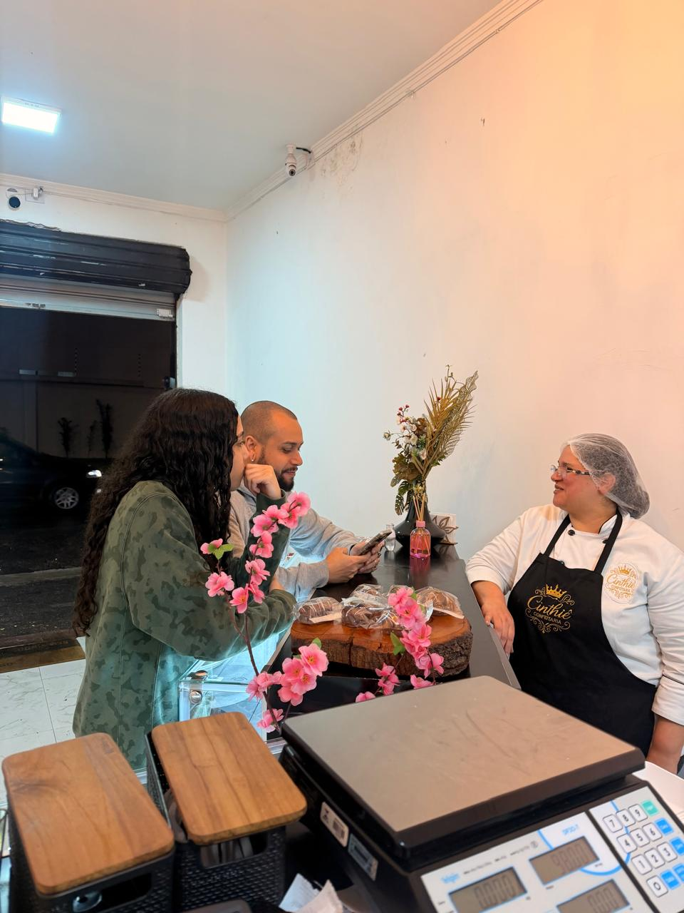
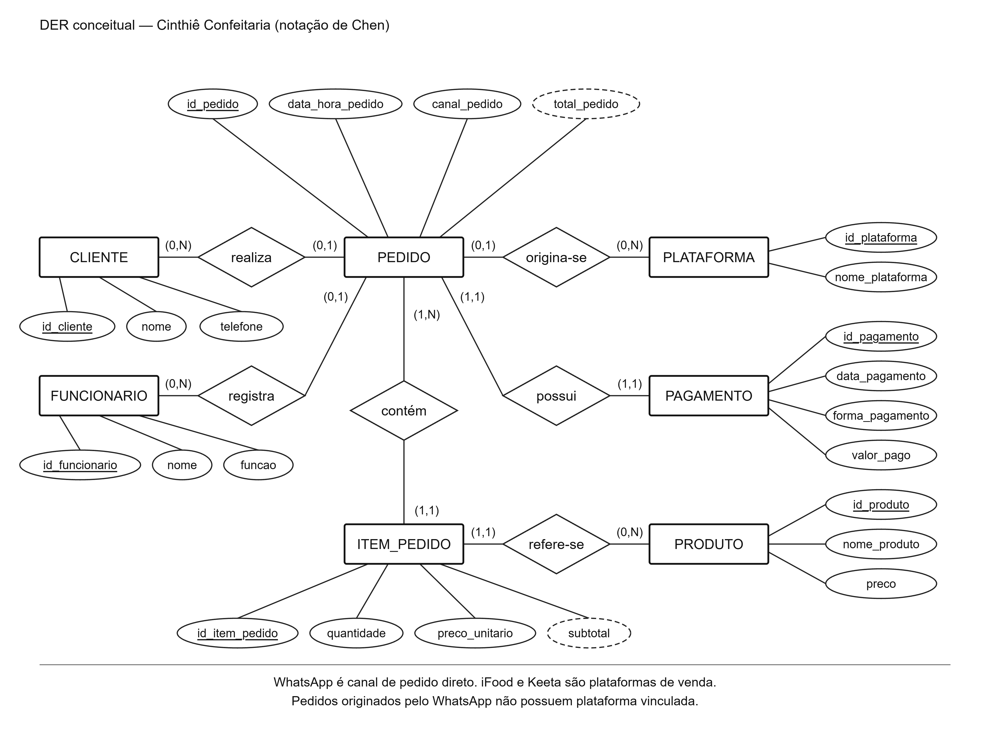

# Entrega 1 — Modelo Conceitual (DER)
## Sistema de gestão de informações da Cinthiê Confeitaria

## Metadados

- **Integrantes e RGM:**
  - Douglas Lourenço de Lima — RGM: 47892919
  - Erick Costa Liberato — RGM: 48201693
  - Giovanna Pereira Bispo da Silva — RGM: 48065285
  - João Lucas Moreira dos Reis — RGM: 48162086
  - Nicolas Nogueira Borges — RGM: 48329266
- **Disciplina:** Modelagem de Banco de Dados
- **Organização analisada:** Cinthiê Confeitaria

---

## 1. Caracterização da Organização

### Nome e natureza da organização

A organização analisada é a **Cinthiê Confeitaria**, empresa do ramo alimentício que fabrica e comercializa produtos de confeitaria no próprio estabelecimento.

### Contexto e porte

Segundo a entrevista realizada com a responsável pelo estabelecimento, a confeitaria possui três funcionários. As atividades são distribuídas da seguinte forma:

- uma funcionária exerce as funções de **gerente e confeiteira**;
- um funcionário exerce as funções de **ajudante de cozinha e responsável pelo atendimento no balcão**;
- um funcionário exerce a função de **motoboy/entregador**.

Os pedidos podem ser realizados diretamente pelo **WhatsApp**, no **balcão** ou por meio das plataformas **iFood** e **Keeta**. WhatsApp e balcão são considerados canais diretos de atendimento, enquanto iFood e Keeta são tratados como plataformas de venda.

A confeitaria não trabalha com estoque. Os produtos são fabricados conforme a demanda e as encomendas recebidas, com produção realizada aos **domingos e às quartas-feiras**.

### Problemas e necessidades identificados

Atualmente, as informações da organização estão distribuídas entre WhatsApp, planilhas do Microsoft Excel e plataformas de venda. Parte do controle administrativo é realizada ao final do expediente, o que torna a organização e a consolidação das informações mais demoradas.

O sistema proposto busca centralizar os dados de clientes, pedidos, produtos, pagamentos, plataformas e funcionários envolvidos nas operações, reduzindo o tempo gasto na organização das informações e facilitando consultas e controles.

### Justificativa da escolha

A Cinthiê Confeitaria foi escolhida por ser uma organização real de pequeno porte e por permitir ao grupo a realização de pesquisa de campo. O estabelecimento possui uma rotina que envolve atendimento ao cliente, recebimento de pedidos por diferentes canais, fabricação sob demanda, pagamentos, entregas e controle administrativo, o que possibilita identificar entidades, atributos e relacionamentos relevantes para a elaboração de um modelo conceitual de dados.

Além disso, a utilização de WhatsApp, planilhas e plataformas de venda demonstra a existência de diferentes fontes de informação que podem ser organizadas de forma centralizada por meio de um banco de dados.

### Evidências da organização

Como evidências da pesquisa de campo, foram realizadas fotografias do estabelecimento e uma gravação de áudio da entrevista com a responsável pela confeitaria. Esses materiais foram utilizados para apoiar o levantamento das informações, respeitando a autorização e a privacidade das pessoas envolvidas.

---

## 2. Processos de Negócio

Os processos de negócio identificados foram:

1. **Atendimento e registro de clientes:** atendimento realizado principalmente pelo WhatsApp e no balcão, com registro das informações necessárias para identificação e acompanhamento dos pedidos.
2. **Recebimento e registro de pedidos:** registro de pedidos realizados pelo WhatsApp, balcão, iFood ou Keeta.
3. **Composição do pedido:** associação de um ou mais produtos ao pedido, registrando a quantidade solicitada e o preço praticado.
4. **Fabricação dos produtos:** produção realizada conforme a demanda e as encomendas recebidas. A fabricação ocorre aos domingos e às quartas-feiras. Como os produtos são produzidos de acordo com os pedidos, não há controle de estoque no escopo deste sistema.
5. **Registro de pagamentos:** nos pedidos realizados pelo WhatsApp ou balcão, a forma de pagamento pode ser dinheiro, cartão ou Pix. Nos pedidos realizados por plataformas, não é necessário registrar a forma específica utilizada pelo cliente.
6. **Acompanhamento de vendas por plataforma:** identificação dos pedidos realizados pelo iFood ou Keeta e acompanhamento dos repasses dessas plataformas.
7. **Participação dos funcionários:** os funcionários podem atuar no atendimento, produção ou entrega dos pedidos, de acordo com suas funções.
8. **Controle administrativo:** consolidação das informações administrativas, atualmente apoiada por planilhas do Excel e parcialmente executada ao final do expediente.

---

## 3. Requisitos Funcionais

| Código | Requisito funcional |
|---|---|
| RF01 | O sistema deve permitir cadastrar clientes. |
| RF02 | O sistema deve permitir consultar clientes cadastrados. |
| RF03 | O sistema deve permitir registrar pedidos. |
| RF04 | O sistema deve permitir consultar pedidos registrados. |
| RF05 | O sistema deve permitir cadastrar produtos. |
| RF06 | O sistema deve permitir consultar produtos cadastrados. |
| RF07 | O sistema deve permitir associar um ou mais produtos a cada pedido, registrando a quantidade solicitada. |
| RF08 | O sistema deve permitir registrar e consultar o status do pedido. |
| RF09 | O sistema deve permitir registrar pagamentos relacionados aos pedidos. |
| RF10 | O sistema deve permitir registrar a forma de pagamento dos pedidos realizados pelo WhatsApp ou balcão: dinheiro, cartão ou Pix. |
| RF11 | O sistema deve permitir registrar pagamentos de pedidos realizados por plataforma sem exigir a forma de pagamento utilizada pelo cliente. |
| RF12 | O sistema deve permitir identificar o canal de origem de cada pedido: WhatsApp, balcão ou plataforma. |
| RF13 | O sistema deve permitir vincular pedidos realizados por plataforma ao iFood ou à Keeta. |
| RF14 | O sistema deve permitir consultar informações de vendas por período, produto, canal e plataforma. |
| RF15 | O sistema deve permitir cadastrar funcionários. |
| RF16 | O sistema deve permitir consultar funcionários cadastrados e suas funções. |
| RF17 | O sistema deve permitir associar ao pedido os funcionários que participaram do atendimento, produção ou entrega, quando essa informação for registrada. |

---

## 4. Regras de Negócio

| Código | Regra de negócio |
|---|---|
| RN01 | Todo pedido deve registrar seu canal de origem: WhatsApp, balcão ou plataforma. |
| RN02 | WhatsApp e balcão são canais diretos de pedido e não são plataformas de venda. |
| RN03 | As plataformas de venda utilizadas pela organização são iFood e Keeta. |
| RN04 | Todo pedido originado por plataforma deve identificar a plataforma correspondente. Pedidos realizados pelo WhatsApp ou balcão não possuem plataforma vinculada. |
| RN05 | Todo pedido deve possuir um ou mais produtos associados. |
| RN06 | Para cada produto associado a um pedido, devem ser registradas a quantidade solicitada e o preço unitário praticado no momento da venda. |
| RN07 | O valor total do pedido é calculado a partir da soma de quantidade × preço unitário de todos os produtos associados ao pedido. |
| RN08 | Todo pedido deve possuir um status que represente sua situação atual. |
| RN09 | Um pedido ainda não finalizado pode não possuir pagamento registrado. Quando finalizado, deve possuir seu respectivo pagamento. |
| RN10 | Nos pedidos realizados pelo WhatsApp ou balcão, a forma de pagamento deve ser registrada como dinheiro, cartão ou Pix. |
| RN11 | Nos pedidos realizados por iFood ou Keeta, não é necessário registrar a forma específica de pagamento utilizada pelo cliente. |
| RN12 | A confeitaria não trabalha com estoque, pois os produtos são fabricados de acordo com a demanda e as encomendas recebidas. |
| RN13 | A fabricação dos produtos ocorre aos domingos e às quartas-feiras, de acordo com as encomendas e a demanda. |
| RN14 | A organização possui três funcionários: uma gerente/confeiteira, um ajudante de cozinha que também realiza atendimento no balcão e um motoboy/entregador. |
| RN15 | Um funcionário pode participar de vários pedidos, e um pedido pode envolver mais de um funcionário em atividades de atendimento, produção ou entrega. |
| RN16 | Os repasses das plataformas são acompanhados semanalmente, conforme o procedimento administrativo adotado pelo estabelecimento. |

> **Decisão de escopo:** o acompanhamento de repasses foi identificado na pesquisa de campo, mas nesta Entrega 1 ele é mantido como regra de negócio. Não foi criada uma entidade específica para repasse no modelo conceitual.

---

## 5. Dicionário de Dados

### CLIENTE

| Atributo | Descrição | Regra de negócio associada |
|---|---|---|
| id_cliente | Identificador único do cliente. | Chave primária da entidade. |
| nome | Nome do cliente. | Utilizado para identificação. |
| telefone | Número de telefone utilizado no contato, inclusive pelo WhatsApp. | Pode ser utilizado para atendimento e contato. |

### FUNCIONARIO

| Atributo | Descrição | Regra de negócio associada |
|---|---|---|
| id_funcionario | Identificador único do funcionário. | Chave primária da entidade. |
| nome | Nome do funcionário. | Utilizado para identificação. |
| funcao | Função ou combinação de funções exercidas pelo funcionário. | Foram identificados os valores gerente/confeiteira, ajudante de cozinha/atendimento no balcão e motoboy/entregador. |

### PRODUTO

| Atributo | Descrição | Regra de negócio associada |
|---|---|---|
| id_produto | Identificador único do produto. | Chave primária da entidade. |
| nome_produto | Nome do produto comercializado. | Identifica o produto oferecido pela confeitaria. |
| preco | Preço atual do produto. | Representa o preço atualmente praticado no cadastro do produto. |

### PEDIDO

| Atributo | Descrição | Regra de negócio associada |
|---|---|---|
| id_pedido | Identificador único do pedido. | Chave primária da entidade. |
| data_hora_pedido | Data e horário do registro do pedido. | Utilizado para acompanhamento e consultas por período. |
| canal_pedido | Canal de origem do pedido. | Aceita WhatsApp, Balcão ou Plataforma. |
| status_pedido | Situação atual do pedido. | Deve permitir acompanhar o andamento do pedido. |
| total_pedido | Valor total do pedido. | Atributo derivado da soma de quantidade × preço unitário dos produtos associados ao pedido. |

### Relacionamento CONTÉM — PEDIDO x PRODUTO

| Atributo | Descrição | Regra de negócio associada |
|---|---|---|
| quantidade | Quantidade do produto solicitada no pedido. | Deve ser maior que zero. |
| preco_unitario | Preço do produto praticado no momento do pedido. | Permite preservar o valor da venda mesmo que o preço atual do produto seja alterado posteriormente. |

> **Observação:** `CONTÉM` é um relacionamento entre as entidades PEDIDO e PRODUTO, e não uma entidade independente.

### PAGAMENTO

| Atributo | Descrição | Regra de negócio associada |
|---|---|---|
| id_pagamento | Identificador único do pagamento. | Chave primária da entidade. |
| data_pagamento | Data do registro do pagamento. | Pode ser registrada quando o pagamento for confirmado. |
| forma_pagamento | Forma utilizada para pagamento. | Obrigatória para pedidos de WhatsApp ou balcão, aceitando dinheiro, cartão ou Pix; não é obrigatória para pedidos de plataforma. |
| valor_pago | Valor registrado no pagamento. | Deve estar relacionado ao valor do pedido. |

### PLATAFORMA

| Atributo | Descrição | Regra de negócio associada |
|---|---|---|
| id_plataforma | Identificador único da plataforma. | Chave primária da entidade. |
| nome_plataforma | Nome da plataforma de venda. | Aceita iFood ou Keeta. |

---

## 6. Modelagem Conceitual

### Entidades reconhecidas

| Entidade | Justificativa |
|---|---|
| CLIENTE | Representa as pessoas atendidas pela confeitaria e permite organizar seus dados de contato. |
| FUNCIONARIO | Representa os três colaboradores envolvidos na gestão, produção, atendimento e entrega. |
| PRODUTO | Representa os produtos fabricados sob demanda e comercializados pela confeitaria. |
| PEDIDO | Representa cada solicitação de compra realizada pelos clientes. |
| PAGAMENTO | Representa o pagamento relacionado ao pedido. |
| PLATAFORMA | Identifica os pedidos realizados por iFood ou Keeta. |

### Relacionamentos e cardinalidades

| Relacionamento | Cardinalidade | Justificativa |
|---|---|---|
| Cliente realiza Pedido | Cliente (0,N) — Pedido (0,1) | Um cliente pode realizar vários pedidos; um pedido pode não possuir cliente cadastrado quando não houver identificação disponível. |
| Pedido contém Produto | Pedido (1,N) — Produto (0,N) | Todo pedido deve conter um ou mais produtos, e um produto pode aparecer em vários pedidos. O relacionamento registra quantidade e preço unitário. |
| Funcionário participa de Pedido | Funcionário (0,N) — Pedido (0,N) | Um funcionário pode participar de vários pedidos e um pedido pode envolver mais de um funcionário em atividades de atendimento, produção ou entrega. |
| Pedido possui Pagamento | Pedido (0,1) — Pagamento (1,1) | Um pedido pode ainda não possuir pagamento enquanto não estiver finalizado; todo pagamento registrado pertence a um único pedido. |
| Pedido origina-se de Plataforma | Pedido (0,1) — Plataforma (0,N) | Pedidos de WhatsApp ou balcão não possuem plataforma vinculada. Pedidos de plataforma devem identificar iFood ou Keeta. |

### Restrições aplicadas ao modelo

- PEDIDO e PRODUTO são ligados diretamente pelo relacionamento muitos-para-muitos `CONTÉM`, sem a criação de uma entidade intermediária.
- O relacionamento `CONTÉM` registra `quantidade` e `preco_unitario` para cada produto associado a um pedido.
- WhatsApp e balcão são canais diretos; iFood e Keeta são plataformas de venda.
- A forma de pagamento é obrigatória para pedidos diretos realizados pelo WhatsApp ou balcão, mas não precisa ser detalhada para pedidos realizados por plataforma.
- Não foram incluídas entidades de estoque ou ingredientes, pois a confeitaria não trabalha com estoque no escopo levantado e fabrica os produtos conforme a demanda.
- A fabricação ocorre aos domingos e às quartas-feiras, conforme as encomendas e a demanda.
- O motoboy/entregador é um dos três funcionários da confeitaria e, portanto, é representado pela entidade FUNCIONARIO.
- Gerente e confeiteira são funções exercidas pela mesma funcionária. Ajudante de cozinha e atendimento no balcão são funções exercidas pelo mesmo funcionário.
- Não foi criada uma entidade específica para entrega, pois a entrega pode ser representada como uma atividade realizada por funcionário associado ao pedido nesta etapa do modelo.

---

## 7. Diagrama Entidade-Relacionamento (DER)

O diagrama conceitual deve utilizar a notação de Chen e representar as entidades, atributos, relacionamentos e cardinalidades descritos neste documento.

A versão atualizada do DER deve apresentar, no mínimo, os seguintes relacionamentos:

- CLIENTE — **REALIZA** — PEDIDO;
- PEDIDO — **CONTÉM** — PRODUTO, com os atributos `quantidade` e `preco_unitario` no relacionamento;
- FUNCIONARIO — **PARTICIPA DE** — PEDIDO;
- PEDIDO — **POSSUI** — PAGAMENTO;
- PEDIDO — **ORIGINA-SE DE** — PLATAFORMA.

A imagem abaixo deve ser atualizada para refletir essas alterações, especialmente a relação direta entre PEDIDO e PRODUTO, a inclusão do balcão, do status do pedido e a nova interpretação de FUNCIONARIO.

---

## 8. Justificativa Técnica

O modelo foi elaborado para centralizar informações atualmente distribuídas entre WhatsApp, planilhas do Excel, iFood e Keeta, mantendo apenas elementos compatíveis com o funcionamento confirmado durante a pesquisa de campo.

Conforme orientação do professor, **PEDIDO** e **PRODUTO** passaram a ser representados diretamente pelo relacionamento muitos-para-muitos `CONTÉM`, sem entidade intermediária. Os atributos `quantidade` e `preco_unitario` pertencem a esse relacionamento porque seus valores dependem de cada ocorrência de produto em um pedido.

A entidade **FUNCIONARIO** foi mantida porque o sistema deverá armazenar informações dos três colaboradores da confeitaria. Uma funcionária exerce as funções de gerente e confeiteira; outro funcionário atua como ajudante de cozinha e também no atendimento do balcão; e o terceiro funcionário atua como motoboy/entregador. Como mais de um funcionário pode participar de um mesmo pedido, o relacionamento entre FUNCIONARIO e PEDIDO foi definido como muitos-para-muitos.

O **balcão** foi incluído como canal direto de pedido, juntamente com o WhatsApp. Já iFood e Keeta são representados pela entidade PLATAFORMA. Dessa forma, um pedido pode ter como canal WhatsApp, balcão ou plataforma; quando o canal for plataforma, deve existir vínculo com iFood ou Keeta.

O atributo `status_pedido` foi incluído em PEDIDO para permitir distinguir pedidos ainda em andamento de pedidos finalizados. Essa informação também torna coerente a cardinalidade entre PEDIDO e PAGAMENTO: um pedido em andamento pode ainda não possuir pagamento, enquanto todo pagamento registrado deve pertencer a um pedido.

O tratamento dos pagamentos depende do canal do pedido. Para pedidos realizados pelo WhatsApp ou balcão, a forma de pagamento deve ser registrada como dinheiro, cartão ou Pix. Para pedidos realizados pelo iFood ou Keeta, não é necessário registrar a forma específica utilizada pelo cliente, pois essa informação não faz parte da necessidade identificada para o sistema.

Não foram incluídas entidades de estoque ou ingredientes. A confeitaria não trabalha com estoque, pois a fabricação é realizada de acordo com a demanda e as encomendas, aos domingos e às quartas-feiras.

O atributo `total_pedido` é derivado dos produtos associados ao pedido, considerando a quantidade e o preço unitário praticado em cada relação entre PEDIDO e PRODUTO. Essa decisão permite calcular o total sem depender apenas do preço atual cadastrado em PRODUTO.

---

## 9. Uso de Inteligência Artificial

| Item | Registro |
|---|---|
| Ferramenta e etapa | ChatGPT/Codex foi utilizado para organizar informações da entrevista, revisar requisitos, discutir regras de negócio, identificar inconsistências e apoiar a elaboração do DER e deste README. |
| Motivação | Estruturar o trabalho conforme as orientações da disciplina, melhorar a coerência entre as seções e revisar a modelagem conceitual. |
| Prompt(s) utilizados | Foram utilizados prompts para revisar o README, identificar possíveis erros, representar diretamente a relação entre PEDIDO e PRODUTO conforme orientação do professor, corrigir o tratamento de balcão e plataformas e ajustar funcionários, pagamentos e produção sob demanda. |
| Sugestões recebidas | Foram sugeridas revisões de entidades, relacionamentos, cardinalidades, requisitos, regras de negócio e redação. |
| Trechos rejeitados ou corrigidos | Foram corrigidas sugestões anteriores que tratavam o motoboy como terceirizado, que incluíam controle de estoque e que criavam uma entidade intermediária entre PEDIDO e PRODUTO. Também foram revistas informações sobre canais de pedido e formas de pagamento. |
| Justificativa da escolha final | O grupo manteve as decisões compatíveis com a entrevista, com as informações posteriormente confirmadas sobre o funcionamento da confeitaria e com a orientação do professor para a modelagem conceitual. |
| Reflexão crítica | A IA foi utilizada como ferramenta de apoio à organização e revisão do trabalho. As informações sobre a organização foram obtidas na pesquisa de campo, e o grupo permaneceu responsável por verificar as sugestões e decidir quais alterações eram compatíveis com a realidade observada. |
